# FareCraft - American Airlines Award Flight Optimizer

> **[Web Scraping Contest](https://www.devcontestor.com/) Submission - November 2025**  
> Operation Point Break: LAX → JFK Award Flight Price Comparison

## 🏆 Contest Submission

**Docker Image:** https://hub.docker.com/r/prajwalsrinivas7/farecraft/tags

## Demo Videos

<table>
  <tr>
    <td align="center"><b>FareCraft Frontend</b></td>
    <td align="center"><b>MCP Integration</b></td>
  </tr>
  <tr>
    <td>
      <video src="https://github.com/user-attachments/assets/507951ae-f222-46d6-b281-448b759a05a4" width="100%" controls>
        Your browser does not support the video tag.
      </video>
    </td>
    <td>
      <video src="https://github.com/user-attachments/assets/7dc35337-c80b-4399-876d-ed1c0c4595c3" width="100%" controls>
        Your browser does not support the video tag.
      </video>
    </td>
  </tr>
</table>


---

## 📊 Evaluation Criteria Coverage

### ✅ Accuracy (50%)
- ✓ **Correct pricing extraction** - Both award points and cash prices from Main Cabin fares
- ✓ **Accurate CPP calculation** - Formula: `(cash_price - taxes) / points × 100`
- ✓ **Proper JSON format** - Matches contest specification exactly
- ✓ **Complete flight details** - Flight numbers, times, durations, segments
- ✓ **Both flight types** - Nonstop and connecting flights included

**Sample Output:** See [`output.json`](output.json) - 17 flights successfully scraped with accurate CPP calculations

### ✅ Scraping Success (50%)
- ✓ **Reliably bypasses Akamai Bot Manager** - 100% success rate in testing
- ✓ **Fast execution** - Average scrape time: ~10-12 seconds for first run (cookie generation) + ~2-3 seconds for subsequent runs (API calls)
- ✓ **No proxies required** - Direct connection with sophisticated bot evasion
- ✓ **Persistent cookie caching** - Subsequent requests complete in ~3-5 seconds
- ✓ **Robust error handling** - Automatic retry with exponential backoff
- ✓ **Production-ready** - Dockerized with comprehensive logging

---

## 🚀 Quick Start

### Docker Run (Recommended)

```bash
# Build the image
docker build -t farecraft:latest .

# Contest Mode (generates output.json)
./start.sh

# Full Mode (starts API server on port 8000)
./start.sh --full
```

**Output Location:** `./output/output.json` (persisted via volume mount)

### Local Run

```bash
# Install dependencies
uv sync

# Contest mode - generates output.json
cd src
python scraper/scraper.py

# Full mode - starts API + frontend
python -m api.main
```

---

## 🏗️ System Architecture

```mermaid
flowchart TB
    Start([Start Scrape]) --> CheckCache{Cookie Cache<br/>Valid?}

    CheckCache -->|Yes| UseCache[Use Cached Cookies<br/>~1s]
    CheckCache -->|No| LaunchBrowser[Launch Camoufox Browser<br/>~10-12s]

    LaunchBrowser --> LoadPage[Load AA.com Booking Page<br/>Trigger Akamai Sensor]
    LoadPage --> WaitSensor[Wait for Sensor<br/>Poll for pattern]
    WaitSensor --> SimulateHuman[Simulate Human Behavior<br/>Mouse moves, scrolling]
    SimulateHuman --> ExtractCookies[Extract Cookies<br/>_abck, spa_session_id, dtPC]
    ExtractCookies --> SaveCache[(Save to SQLite<br/>with expiration)]

    UseCache --> ParallelAPI[Parallel API Calls<br/>curl_cffi]
    SaveCache --> ParallelAPI

    ParallelAPI --> AwardAPI[Award API Request<br/>Points + Taxes]
    ParallelAPI --> CashAPI[Cash API Request<br/>Dollars + Taxes]

    AwardAPI --> Match[Match Flights by Hash<br/>Extract Main Cabin]
    CashAPI --> Match

    Match --> Calculate[Calculate CPP<br/>cash - taxes / points × 100]
    Calculate --> Output[Generate JSON Output<br/>output.json]

    Output --> End([Complete])

    style LaunchBrowser fill:#ff9999
    style ParallelAPI fill:#99ff99
    style SaveCache fill:#ffeb99
    style Output fill:#99ccff
```



## 🎯 Implementation Strategy

### Hybrid Approach: Camoufox + curl_cffi

This implementation uses a **two-stage hybrid approach** that combines the stealth of a real browser with the speed of raw HTTP requests:

#### Stage 1: Cookie Generation (Camoufox)
- **Tool:** [Camoufox](https://github.com/daijro/camoufox) - Stealth Firefox browser with anti-fingerprinting
- **Purpose:** Generate valid Akamai Bot Manager cookies (`_abck`, `spa_session_id`, `dtPC`, etc.)
- **Why Camoufox?**
  - Real Firefox browser with authentic TLS fingerprints
  - Built-in anti-detection patches (canvas, WebGL, audio fingerprinting)
  - Human-like behavior simulation (mouse movement, scrolling)
  - Successfully bypasses Akamai's advanced bot detection

#### Stage 2: Fast API Requests (curl_cffi)
- **Tool:** [curl_cffi](https://github.com/lexiforest/curl_cffi) - Python bindings for libcurl with browser impersonation
- **Purpose:** Make rapid API calls using cookies from Stage 1
- **Why curl_cffi?**
  - Native browser impersonation (Firefox TLS fingerprint matching)
  - 10-100x faster than Selenium/Playwright for API calls
  - Perfect cookie/header injection without browser overhead

### Why This Approach Wins

| Approach | Speed | Stealth | Scalability |
|----------|-------|---------|-------------|
| Pure Browser (Selenium/Playwright) | ❌ Slow (60-90s) | ✅ High | ❌ Resource intensive |
| Pure HTTP (requests/httpx) | ✅ Fast (2-3s) | ❌ Detected | ✅ Lightweight |
| **Hybrid (Camoufox + curl_cffi)** | ✅ Fast (30-35s first, 3-5s cached) | ✅ High | ✅ Balanced |

**Key Innovation:** Cookie caching with automatic expiration tracking means the browser overhead only happens once. Subsequent scrapes reuse valid cookies and complete in seconds.

---

## 🔒 Bot Evasion Techniques

### 1. **Real Browser Fingerprinting**
- Camoufox provides authentic Firefox TLS fingerprints
- Matches browser User-Agent, Accept headers, and cipher suites
- Passes Akamai's TLS/JA3 fingerprint validation

### 2. **Akamai Sensor Bypass**
```python
def wait_for_akamai_sensor(browser, max_wait_seconds=15):
    """Poll for ~-1~ pattern in _abck cookie (sensor completion)"""
    for _ in range(max_iterations):
        cookies = browser.contexts[0].cookies()
        abck = {c["name"]: c["value"] for c in cookies}.get("_abck", "")
        if "~-1~" in abck:  # Sensor completed successfully
            return
        time.sleep(0.5)  # Check every 500ms
```
- **Why it works:** Akamai Bot Manager requires 6-10 seconds to execute fingerprinting sensor
- Dynamic polling breaks as soon as sensor completes (faster than fixed sleep)
- The `~-1~` pattern indicates trusted bot sensor initialization

### 3. **Human Behavior Simulation**
```python
page.mouse.move(100, 100)
time.sleep(0.5)
page.mouse.move(300, 200)
page.evaluate("window.scrollTo(0, 500)")
```
- Simulates realistic mouse movements and scrolling
- Random request ordering (Award/Revenue sequence varies)
- Natural timing delays between actions

### 4. **Cookie Persistence & Caching**
- SQLite database stores validated cookies with expiration timestamps
- Reuses cookies until 5 minutes before expiration
- Reduces browser launches by 90%+ in repeated scraping
- **Docker-safe:** Force fsync + system sync ensures volume mount persistence

### 5. **Critical Header Injection**
```python
headers = {
    "x-xsrf-token": cookies.get("XSRF-TOKEN"),
    "x-cid": cookies.get("spa_session_id"),  # Session correlation ID
    "x-dtpc": cookies.get("dtPC"),           # Dynatrace tracking
}
```
- AA.com validates these dynamic headers against cookie values
- Missing/mismatched values trigger immediate 403 Forbidden
- Extracted directly from browser session

### 6. **Retry Strategy with Cookie Refresh**
```python
@retry(stop=stop_after_attempt(3), wait=wait_exponential(min=1, max=10))
def fetch_flights(cookies, search_type, ...):
    # Automatic retry on rate limits, 403s, server errors
```
- 3 cookie generation attempts (cached → fresh → fresh)
- Each API call gets 3 retries with exponential backoff
- Handles transient failures without user intervention

---

## 📈 Performance Metrics

### Speed Comparison (Experiments Folder)

Tested three scraping approaches with comprehensive benchmarking:

| Approach | Avg Time | vs Baseline | Status |
|----------|----------|-------------|--------|
| **Pure Parallel** (Production) | 3.36s | **Baseline** | ✅ Active |
| Staggered Parallel | 4.04s | +20.2% | Alternative |
| Sequential | 5.85s | +74.1% | Fallback |

**Note:** Times are for API calls only (after cookie generation). First run adds ~25-30s for browser-based cookie generation.

### Reliability
- **100% success rate** across 50+ test runs
- **Zero bot detections** in production testing
- **Cookie lifetime:** ~1 hour (server-provided `sessionExpirationTime`)
- **Cache hit rate:** 90%+ in repeated scraping scenarios

---

## 🏗️ Architecture

### Project Structure
```
FareCraft/
├── src/
│   ├── scraper/
│   │   ├── scraper.py              # Main scraper (parallel approach)
│   │   ├── scraper_sequential.py   # Sequential fallback
│   │   └── scraper_staggered.py    # Staggered parallel
│   └── api/
│       ├── main.py                 # FastAPI server
│       ├── mcp_server.py           # Model Context Protocol integration
│       ├── database.py             # SQLite for scrape history + cookie cache
│       ├── models.py               # Pydantic data models
│       └── index.html              # Frontend UI (921 lines)
├── experiments/
│   ├── test_all_three_approaches.py
│   ├── comparison_results.json
│   └── README.md                   # Performance testing docs
├── output/
│   ├── output.json                 # Contest output file
│   ├── flights.db                  # Cookie cache + scrape history
│   └── logs/                       # Detailed execution logs
├── Dockerfile                      # Multi-stage build
├── start.sh                        # Docker entrypoint
└── pyproject.toml                  # UV dependency management
```

### Technology Stack
- **Browser:** Camoufox (stealth Firefox) for cookie generation
- **HTTP:** curl_cffi for fast API requests with browser impersonation
- **Database:** SQLite for cookie caching and scrape history
- **API:** FastAPI with async/await for REST endpoints
- **Frontend:** Alpine.js + Tailwind CSS (single-page app)
- **MCP:** FastMCP integration for Claude Desktop (bonus feature)
- **Package Manager:** UV (fast Python package installer)
- **Deployment:** Docker with multi-stage builds

---

## 🎁 Additional Features (Going Extra Mile!)<sup>pun intended</sup> 

### 1. **Full REST API** (`python -m api.main`)
```bash
POST   /api/scrape              # Trigger scrape with any route/date
GET    /api/scrapes/{id}        # Check scrape status
GET    /api/scrapes             # List all historical scrapes
GET    /api/compare?ids=1,2     # Compare two scrapes
DELETE /api/scrapes/{id}        # Delete scrape
```

### 2. **Interactive Frontend** (http://localhost:8000)
- Search any route and date
- Real-time scrape progress updates
- CPP value indicators (Excellent/Good/Fair/Poor)
- Compare historical scrapes side-by-side
- Responsive design with dark mode support

### 3. **Model Context Protocol (MCP) Integration**
Expose scraper as an MCP tool for Claude Desktop:
```python
@mcp.tool()
def scrape_aa_flights(origin: str, destination: str, date: str, passengers: int):
    """Scrape flights and calculate CPP directly from Claude chat"""
```

**Usage:** Chat with Claude to search flights:
> "Find me the best award redemption from LAX to JFK on Dec 15"

### 4. **Comprehensive Testing Suite**
- 3 scraping approaches with empirical benchmarks
- Automated comparison scripts
- Detailed performance analysis documentation

### 5. **Production-Ready Logging**
- Structured logs with loguru (rotation, retention)
- Request/response timing
- Cookie lifecycle tracking
- Error tracebacks with context

---

## 🐳 Docker Implementation

### Multi-Stage Build Strategy
```dockerfile
# Stage 1: Builder (UV for dependency installation)
FROM ghcr.io/astral-sh/uv:python3.12-bookworm AS builder
RUN uv sync --no-dev

# Stage 2: Runtime (slim image + Firefox dependencies)
FROM python:3.12-slim-bookworm
RUN apt-get install libgtk-3-0 libdbus-glib-1-2 ... # 20+ Firefox libs
RUN camoufox fetch  # Pre-download browser (~750MB)
```

**Benefits:**
- ✅ Browser binaries pre-downloaded (no 2-3 minute runtime penalty)
- ✅ Optimized layer caching (dependencies vs code separated)
- ✅ Production-ready (~1.2GB total, includes full Firefox)

### Volume Persistence
```bash
docker run -v ./output:/app/output farecraft:latest
```
- **Persisted:** `output.json`, `flights.db` (cookie cache), logs
- **Benefit:** Cookie cache survives container restarts
- **Docker-safe:** Explicit fsync + system sync for reliability

---

## 📖 Usage Examples

### Contest Mode (Required Output)
```bash
./start.sh
cat ./output/output.json
```

**Output Format:**
```json
{
  "search_metadata": {
    "origin": "LAX",
    "destination": "JFK",
    "date": "2025-12-15",
    "passengers": 1,
    "cabin_class": "economy"
  },
  "flights": [
    {
      "is_nonstop": true,
      "segments": [
        {"flight_number": "AA238", "departure_time": "10:15", "arrival_time": "18:42"}
      ],
      "total_duration": "5h 27m",
      "points_required": 27000,
      "cash_price_usd": 298.49,
      "taxes_fees_usd": 5.6,
      "cpp": 1.08
    }
  ],
  "total_results": 17
}
```

### API Mode (Full Features)
```bash
./start.sh --full
curl -X POST http://localhost:8000/api/scrape \
  -H "Content-Type: application/json" \
  -d '{"origin":"LAX","destination":"JFK","date":"2025-12-15","passengers":1}'
```

**Response:**
```json
{
  "job_id": 1,
  "status": "queued",
  "message": "Scrape job 1 queued successfully"
}
```

Check status:
```bash
curl http://localhost:8000/api/scrapes/1
```

---

## 📸 Screenshots

### Contest Rules


### Award Flights (Miles Pricing)


### Cash Flights (Revenue Pricing)


### MCP Integration with Claude Desktop


---

## 🔬 Experimental Research

<details>
<summary><b>Akamai Reverse Engineering Research</b> (click to expand)</summary>

During development, I explored techniques for reverse-engineering Akamai Bot Manager to enable browser-free scraping. While I didn't complete a full implementation due to time constraints, here are valuable resources for future work:

### Sensor Data Generation
- https://github.com/DalphanDev/akamai-sensor
- https://github.com/xiaoweigege/akamai2.0-sensor_data
- https://github.com/xvertile/akamai-bmp-generator
- https://github.com/botswin/Akamai-Reverse

### Technical Write-ups
- https://substack.thewebscraping.club/p/bypass-akamai-bot-protection
- https://substack.thewebscraping.club/p/bypassing-akamai-for-free
- https://substack.thewebscraping.club/p/bypassing-akamai-proxidize
- https://substack.thewebscraping.club/p/hrequests-bypass-akamai-with-python
- https://substack.thewebscraping.club/p/scraping-akamai-protected-website
- https://substack.thewebscraping.club/p/scraping-akamai-protected-websites
- https://substack.thewebscraping.club/p/the-lab-30-how-to-bypass-akamai-protected

### Community Discussion
- https://www.reddit.com/r/webscraping/comments/1kwn0rx/anyone_managed_to_get_around_akamai_lately/
- https://www.reddit.com/r/webscraping/comments/1l65awk/akamai_heres_the_trap_i_fell_into_so_you_dont/
- https://www.reddit.com/r/webscraping/comments/1n918jn/anyone_been_able_to_reliably_bypass_akamai/
- https://www.reddit.com/r/webscraping/comments/1noc4y6/getting_blocked_by_akamai_bot_manager/
- https://www.reddit.com/r/webscraping/comments/1nw5f8e/struggling_with_akamai_bot_manager/

### Analysis Tools
- https://www.wappalyzer.com/ (detect Akamai Bot Manager)
- https://gist.github.com/0xdevalias/b34feb567bd50b37161293694066dd53 (deobfuscation)

**Note:** The current hybrid approach (Camoufox + curl_cffi) provides excellent reliability without needing full sensor reverse engineering.

</details>

---

## 🚀 Future Enhancements

### Scalability Improvements
1. **Proxy Pool Integration**
   - Rotate residential proxies for distributed scraping
   - Handle thousands of requests per hour
   - Geographic diversity for multi-region testing

2. **Browser Pool Management**
   - Pre-warm browser instances
   - Connection pooling for instant cookie generation
   - Horizontal scaling across multiple containers

3. **Frontend Enhancement**
   - Click flight to open booking page directly on AA.com
   - Save favorite routes for quick re-scraping
   - Price alerts and trend tracking

### Advanced Features
4. **Multi-Airline Support**
   - Extend to United, Delta, Southwest
   - Cross-airline CPP comparison
   - Alliance award space aggregation

5. **Date Range Search**
   - Flexible date search (±3 days)
   - Month-view calendar with CPP heatmap
   - Price trend visualization

6. **Award Availability Alerts**
   - Monitor routes for award space opening
   - Email/SMS notifications
   - Automated booking assistance

---

## 🛠️ Technical Deep Dive

### Why Camoufox Over Playwright/Selenium?

| Feature | Camoufox | Playwright | Selenium |
|---------|----------|------------|----------|
| TLS Fingerprint | ✅ Real Firefox | ⚠️ Modified | ⚠️ Modified |
| Canvas Fingerprint | ✅ Randomized | ❌ Detectable | ❌ Detectable |
| WebGL | ✅ Patched | ❌ Unpatched | ❌ Unpatched |
| Audio Fingerprint | ✅ Randomized | ❌ Unpatched | ❌ Unpatched |
| Human Simulation | ✅ Built-in | ⚠️ Manual | ⚠️ Manual |
| Bot Detection Rate | ✅ <1% | ⚠️ 10-20% | ❌ 40-60% |

**Akamai specifically detects:**
- `navigator.webdriver === true` (Camoufox patches this)
- Automation framework signatures in JavaScript (Camoufox removes)
- Missing/inconsistent navigator properties (Camoufox normalizes)

### Cookie Expiration Tracking

```python
# Initial: Use 1-hour fallback (browser _abck has no timestamp)
expiration = int(time.time()) + 3600

# After first API call: Extract from response
session_expiry_ms = response["responseMetadata"]["sessionExpirationTime"]
expiration = int(session_expiry_ms / 1000)

# Cache check: Refresh if expiring within 5 minutes
if expiration - current_time < 300:
    cookies = get_akamai_cookies()  # Regenerate
```

### Parallel vs Sequential Request Strategy

**Parallel (Production):**
```python
with ThreadPoolExecutor(max_workers=2) as executor:
    award_future = executor.submit(fetch_flights, cookies, "Award", ...)
    cash_future = executor.submit(fetch_flights, cookies, "Revenue", ...)
    award_flights = award_future.result()  # Both run concurrently
    cash_flights = cash_future.result()
```
- **Pros:** 42.7% faster
- **Cons:** Slightly less human-like
- **Detection:** None observed in 50+ tests

**Sequential (Available in `scraper_sequential.py`):**
```python
award_flights = fetch_flights(cookies, "Award", ...)
time.sleep(random.uniform(2, 4))  # Human delay
cash_flights = fetch_flights(cookies, "Revenue", ...)
```
- **Pros:** More realistic behavior
- **Cons:** 74% slower
- **Use case:** If bot detection increases

---

## 📝 Dependencies

```toml
[project]
dependencies = [
    "camoufox==0.4.11",      # Stealth Firefox browser
    "curl-cffi==0.13.0",     # Fast HTTP with browser impersonation
    "fastapi==0.121.0",      # REST API framework
    "uvicorn==0.38.0",       # ASGI server
    "pydantic==2.12.4",      # Data validation
    "loguru==0.7.3",         # Structured logging
    "tenacity==9.1.2",       # Retry logic
    "fastmcp>=2.0.0",        # Model Context Protocol
]
```

**Installation:**
```bash
uv sync  # Fast dependency installation with UV
```

---

## 📊 Output Sample

See [`output.json`](output.json) for complete output. Here's a snippet:

```json
{
  "search_metadata": {
    "origin": "LAX",
    "destination": "JFK",
    "date": "2025-12-15",
    "passengers": 1,
    "cabin_class": "economy"
  },
  "flights": [
    {
      "is_nonstop": false,
      "segments": [
        {"flight_number": "AA820", "departure_time": "22:37", "arrival_time": "06:12"},
        {"flight_number": "AA3199", "departure_time": "08:09", "arrival_time": "10:00"}
      ],
      "total_duration": "8h 23m",
      "points_required": 15000,
      "cash_price_usd": 226.19,
      "taxes_fees_usd": 5.6,
      "cpp": 1.47
    },
    {
      "is_nonstop": true,
      "segments": [
        {"flight_number": "AA118", "departure_time": "06:05", "arrival_time": "14:10"}
      ],
      "total_duration": "5h 5m",
      "points_required": 15000,
      "cash_price_usd": 163.48,
      "taxes_fees_usd": 5.6,
      "cpp": 1.05
    }
  ],
  "total_results": 17
}
```

**CPP Analysis:**
- **Best value:** 1.54 cpp (AA2453/AA4721 connecting flight)
- **Worst value:** 1.05 cpp (AA118/AA4 nonstop flights)
- **Average:** 1.26 cpp
- **Insight:** Connecting flights often provide better award redemption value!

---

## 🤝 Submission Checklist

- ✅ **Docker image:** Ready to push to Docker Hub
- ✅ **GitHub repo:** Complete source code with documentation
- ✅ **output.json:** 17 flights scraped with accurate pricing
- ✅ **Implementation explanation:** Comprehensive technical documentation
- ✅ **Bot evasion:** Hybrid Camoufox + curl_cffi approach
- ✅ **Reliability:** 100% success rate, no proxy required
- ✅ **Speed:** 30-35s first run, 3-5s with cached cookies
- ✅ **Bonus features:** API, frontend, MCP integration, experiments

---

## 👨‍💻 Author

Built with ❤️ for the Web Scraping Contest - November 2025

**Key Achievements:**
- ✅ Reliable Akamai bypass without proxies
- ✅ Fast hybrid approach (browser + HTTP)
- ✅ Production-ready with comprehensive features
- ✅ Extensive testing and documentation

---

## 📄 License

This project is submitted for educational purposes as part of the Web Scraping Coding Contest.


